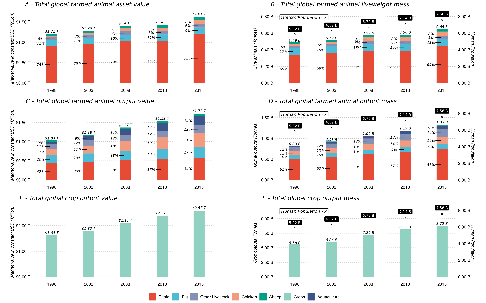
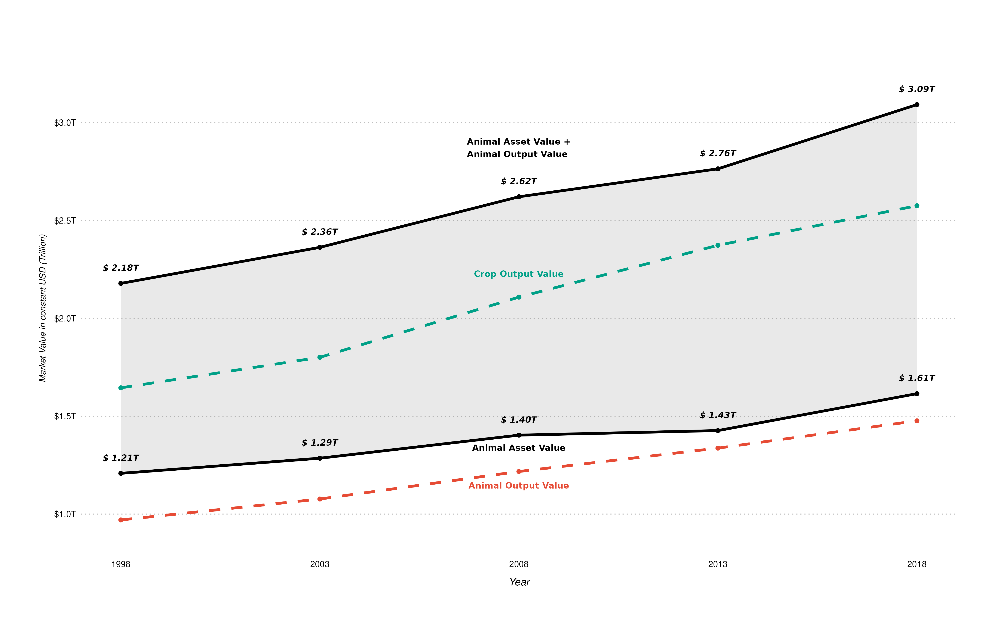
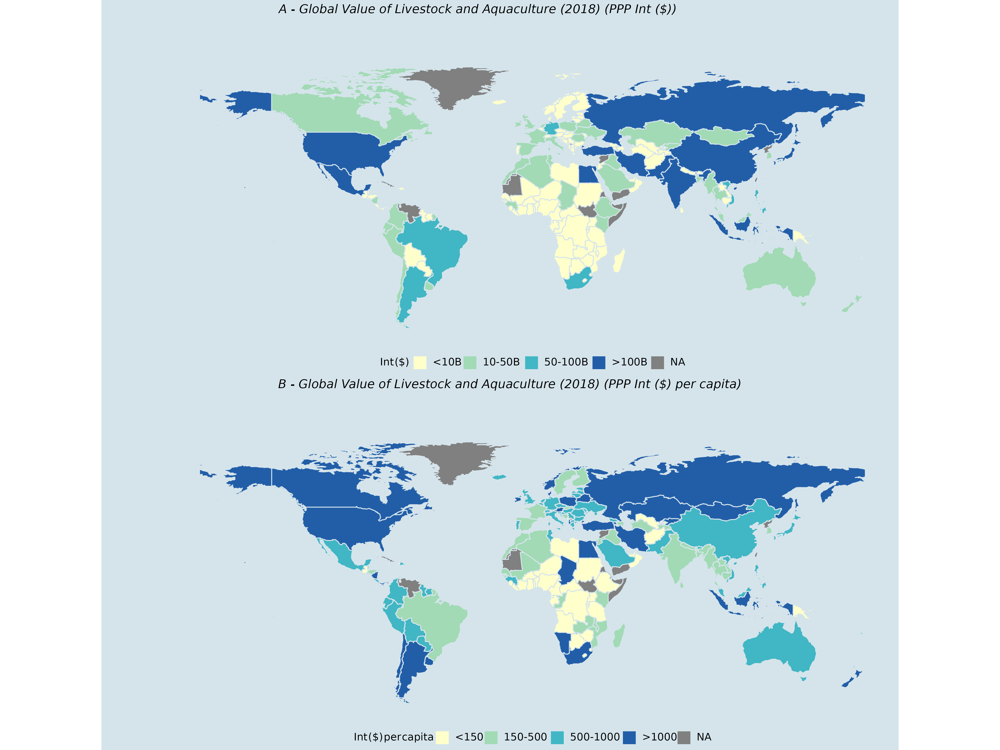
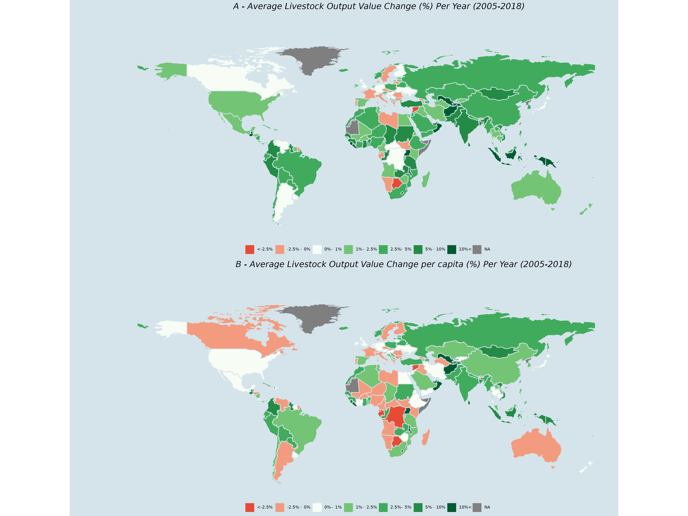

Figures
===============================================================================

<!-- markdown-toc start - Don't edit this section. Run M-x markdown-toc-refresh-toc -->
**Table of Contents**

- [Figures](#figures)
- [Figure Descriptions](#figure-descriptions)
    - [Figure 2](#figure-2)
    - [Figure 3](#figure-3)
    - [Figure 4](#figure-4)
    - [Figure 5](#figure-5)
    - [Figure 6](#figure-6)
    - [Figure 7](#figure-7)
    - [Figure A2](#figure-a2)
    - [Figure A4](#figure-a4)

<!-- markdown-toc end -->

# Figure Descriptions 

The following section contains a short description of all figures 
generated here. 

## Figure 2 

A 3 by 2 plot showing the following comparisons. 

| Row | Panel Left                                    | Panel Right                    |
|-----|-----------------------------------------------|--------------------------------|
| 1   | Livestock and  Assets over time               | Live body weight vs population |
| 2   | Livestock Outputs over time                   | Weight vs population           |
| 3   | Crop Outputs over time (different categories) | Crop weights vs population     |
|-----|-----------------------------------------------|--------------------------------|

Each plot is a stacked area plot showing the different percentages over time. 

## Figure 3 

## Figure 4 

## Figure 5 

## Figure 6 

## Figure 7 

## Figure A2

## Figure A4

